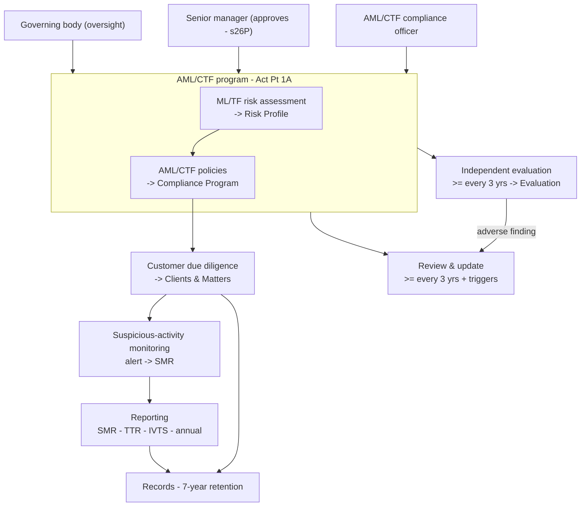
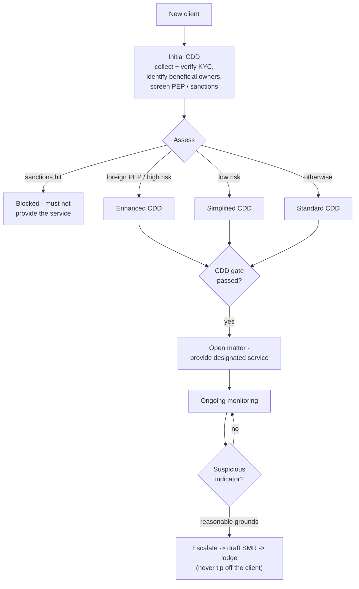

# Onus

**An AI GRC officer for AML/CTF compliance - built for small Australian law firms
under the Tranche 2 reforms.**

From **1 July 2026**, the *Anti-Money Laundering and Counter-Terrorism Financing Act
2006* extends to legal practitioners. Onus turns those obligations into a working
system: it builds and maintains the firm's **AML/CTF program**, runs **customer due
diligence** before the firm acts, **monitors** for suspicious activity, drafts the
**reports** AUSTRAC requires, schedules the **independent evaluation**, and keeps
**audit-ready records** - with an AI that drafts the paperwork and a human who
approves it.

> Onus is software, not legal advice. Generated content is a starting point for a
> qualified person to review. See the per-section specs in [`docs/specs/`](docs/specs/README.md).

---

## System architecture


Three services, orchestrated locally with Docker Compose. The web tier renders
server components and calls the engine through **server-side proxies**, so the JWT
never reaches the browser. Every firm-scoped table is isolated by **enforced
row-level security** (the app connects as a non-superuser role; policies fail closed).
AI is reached through a **provider-agnostic interface** (swap providers via env). See
[Security & multi-tenancy](#security--multi-tenancy) below.

---

## The AML/CTF program model

Onus mirrors AUSTRAC's reformed structure: a program is a **ML/TF risk assessment**
plus **AML/CTF policies**, owned by a governance framework, and kept current through
review, evaluation, reporting and record-keeping.



---

## The per-matter workflow (CDD -> monitoring -> SMR)



---

## Features (mapped to AUSTRAC's guidance)

| Section | What it does | AUSTRAC basis |
|---|---|---|
| **Dashboard** | Reminders (overdue / due-soon), actions required, the live "Onus activity" feed, completable deadlines, and an on-demand monitoring scan | - |
| **Risk Profile** | ML/TF/PF risk assessment - 4 categories, likelihood x impact matrix, country-risk engine, PF screen, AUSTRAC-communications register | Step 2 - Act s26C |
| **Compliance Program** | Policy set + obligation coverage + AI drafting + document-and-approve (role-gated senior-manager sign-off) + review lifecycle with trigger/deadline completion | Steps 1, 3, 4 - Act ss26B-26P |
| **Clients & Matters** | Per-customer-type KYC, beneficial owners, the CDD-tier engine, the before-you-act gate, AI matter classification, inline sanctions/PEP screening, document/evidence upload | Step 3 - Act Pt 2; Risk insights |
| **Sanctions & PEP screening** | DFAT Consolidated List and a PEP list on one versioned pipeline (auto-fetch / manual upload), name + alias matching surfaced for human adjudication, wired into the CDD gate | Rules s5-3 (sanctions), s5-5 (PEP) |
| **Monitoring** | Human-raised indicator alerts plus an automated scan that flags sanctions / PEP / CDD risk conditions across the firm's book, and escalation to a draft SMR | Act s41; Risk insights |
| **Reporting** | SMR / TTR / annual compliance report (with a data-driven annual draft; IVTS and cross-border gated as non-routine) - real deadlines, tipping-off guardrails, 4-regime record retention | Act Pt 3, Pt 10 |
| **Evaluation** | Independent evaluation - AAN-staggered deadline, independence gate, findings & remediation | Step 5 - Act s26F(4)(f); Transitional Rules s17 |
| **Settings & team** | Firm details, user/team management with role-gated approvals, governance roles (s26J eligibility), sanctions/PEP list management, and an immutable audit log | Act s116, s26J |

Cross-cutting: an **AI layer** (policy + SMR drafting and matter classification,
human-in-the-loop, plain-ASCII output), the **agent activity feed**, an **onboarding
wizard** that builds the firm's first risk assessment, and **document/evidence storage**.

---

## Security & multi-tenancy

- **Real row-level security.** Every firm-scoped table has a Postgres RLS policy keyed
  on a per-request `app.current_firm_id` GUC, both `ENABLE`d and `FORCE`d. The app
  connects as a least-privilege, non-superuser role (`onus_app`) so the policies
  actually apply (a superuser/owner bypasses RLS); migrations run as the owner. The
  policy fails closed: with no firm context, no rows are visible.
- **Server-only auth.** The engine JWT lives in the encrypted, httpOnly next-auth
  cookie and is used only server-side through the proxies; it is never returned to the
  browser (including from `/api/auth/session`).
- **Role-gated actions.** Approving the program or risk assessment requires an admin or
  the designated, active senior manager (s26P); managing users and governance roles
  requires an admin; loading the global sanctions/PEP lists is admin-only.
- **Human-in-the-loop.** Onus drafts and flags; a person reviews, approves and lodges.
  It never auto-approves a program or auto-lodges a report.

---

## Tech stack

| Service | Stack |
|---|---|
| `web` | Next.js 14 (App Router) - TypeScript - Tailwind - next-auth - shadcn/ui |
| `engine` | FastAPI - Python 3.11 - SQLAlchemy 2 - Pydantic v2 - Alembic - python-jose - bcrypt - openpyxl - python-multipart |
| `db` | PostgreSQL 15 + pgvector (RLS-enforced; non-superuser app role) |
| AI | Provider-agnostic (`engine/ai/`) - Anthropic / OpenAI / Azure OpenAI, + a mock for tests |

## Repository layout

```
onus/
|-- web/                  # Next.js operator UI
|-- engine/               # FastAPI compliance API
|   |-- models.py         # SQLAlchemy models
|   |-- routers/          # auth, risk_assessment, program, clients, alerts, reports, evaluations, sanctions, documents, firms, dashboard, ...
|   |-- ai/               # provider-agnostic AI: drafting + matter classification
|   |-- sanctions/        # sanctions/PEP list ingest + name matching
|   |-- storage.py        # document/evidence file store; deadlines.py, agent_log.py
|   |-- alembic/          # versioned migrations (incl. RLS + onus_app role)
|   +-- tests/            # pytest (unit + integration against a real DB)
|-- docs/
|   |-- architecture/     # system overview
|   |-- data-model/       # entities & schema notes
|   +-- specs/            # per-section specs, grounded in the Act/Rules with citations
|-- infrastructure/docker/
|-- .github/workflows/    # CI (tsc + lint + pytest)
+-- docker-compose.yml
```

## Local development

```bash
cp .env.local.example .env.local     # fill in secrets (NEXTAUTH_SECRET, AI key, ...)
docker compose up                    # web :3000 - engine :8000 - db :5432
```

Source for `web` and `engine` is bind-mounted (hot reload). The engine runs
`alembic upgrade head` on start. Inside the Compose network the DB host is `db`.

```bash
# migrations
cd engine && alembic revision --autogenerate -m "describe change" && alembic upgrade head
# tests
docker compose exec engine python -m pytest -q     # engine
docker compose exec web npx tsc --noEmit && docker compose exec web npm run lint   # web
```

## Testing & CI

GitHub Actions runs `tsc`, `next lint`, and `pytest` on every PR to `main`/`develop`.
Engine logic that encodes a regulatory rule (risk matrix, country overrides, CDD
tiers, reporting deadlines, evaluation deadlines, catalogues) is pinned by unit tests.

---

*Built grounded in the AML/CTF Act 2006 (Compilation No. 60), AML/CTF Rules 2025, and
AML/CTF Transitional Rules 2026, with AUSTRAC guidance cited inline in the specs.*
