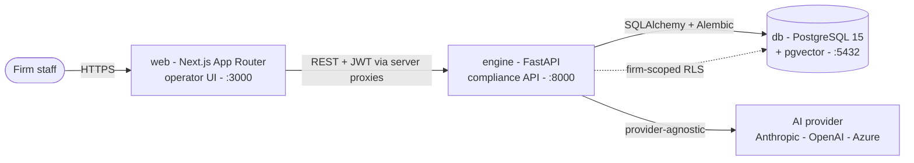
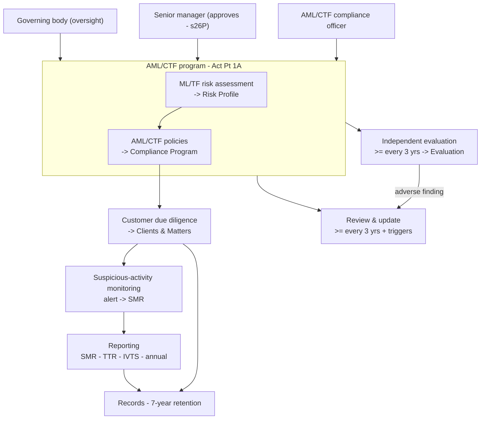
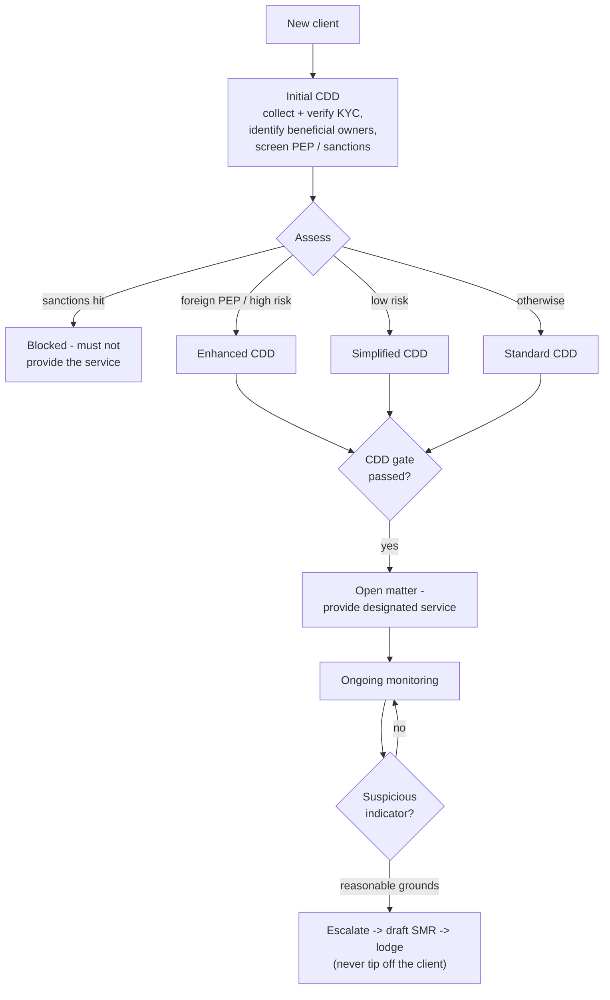

# Onus

**An AI GRC officer for AML/CTF compliance - built for small Australian law firms
under the Tranche 2 reforms.**

From **1 July 2026**, the *Anti-Money Laundering and Counter-Terrorism Financing Act
2006* extends to legal practitioners. Onus turns those obligations into a working
system: it builds and maintains the firm's **AML/CTF program**, runs **customer due
diligence** before the firm acts, **monitors** for suspicious activity, drafts the
**reports** AUSTRAC requires, schedules the **independent evaluation**, and keeps
**audit-ready records** - with an AI that drafts the paperwork and a human who
approves it.

> Onus is software, not legal advice. Generated content is a starting point for a
> qualified person to review. See the per-section specs in [`docs/specs/`](docs/specs/README.md).

---

## System architecture



Three services, orchestrated locally with Docker Compose. The web tier renders
server components and calls the engine through **server-side proxies**, so the JWT
never reaches the browser. Every firm-scoped table is isolated by **enforced
row-level security** (the app connects as a non-superuser role; policies fail closed).
AI is reached through a **provider-agnostic interface** (swap providers via env). See
[Security & multi-tenancy](#security--multi-tenancy) below.

---

## The AML/CTF program model

Onus mirrors AUSTRAC's reformed structure: a program is a **ML/TF risk assessment**
plus **AML/CTF policies**, owned by a governance framework, and kept current through
review, evaluation, reporting and record-keeping.



---

## The per-matter workflow (CDD -> monitoring -> SMR)



---

## Features (mapped to AUSTRAC's guidance)

| Section | What it does | AUSTRAC basis |
|---|---|---|
| **Dashboard** | Reminders (overdue / due-soon), actions required, the live "Onus activity" feed, completable deadlines, and an on-demand monitoring scan | - |
| **Risk Profile** | ML/TF/PF risk assessment - 4 categories, likelihood x impact matrix, country-risk engine, PF screen, AUSTRAC-communications register | Step 2 - Act s26C |
| **Compliance Program** | Policy set + obligation coverage + AI drafting + document-and-approve (role-gated senior-manager sign-off) + review lifecycle with trigger/deadline completion | Steps 1, 3, 4 - Act ss26B-26P |
| **Clients & Matters** | Per-customer-type KYC, beneficial owners, the CDD-tier engine, the before-you-act gate, AI matter classification, inline sanctions/PEP screening, document/evidence upload | Step 3 - Act Pt 2; Risk insights |
| **Sanctions & PEP screening** | DFAT Consolidated List and a PEP list on one versioned pipeline (auto-fetch / manual upload), name + alias matching surfaced for human adjudication, wired into the CDD gate | Rules s5-3 (sanctions), s5-5 (PEP) |
| **Monitoring** | Human-raised indicator alerts plus an automated scan that flags sanctions / PEP / CDD risk conditions across the firm's book, and escalation to a draft SMR | Act s41; Risk insights |
| **Reporting** | SMR / TTR / annual compliance report (with a data-driven annual draft; IVTS and cross-border gated as non-routine) - real deadlines, tipping-off guardrails, 4-regime record retention | Act Pt 3, Pt 10 |
| **Evaluation** | Independent evaluation - AAN-staggered deadline, independence gate, findings & remediation | Step 5 - Act s26F(4)(f); Transitional Rules s17 |
| **Settings & team** | Firm details, user/team management with role-gated approvals, governance roles (s26J eligibility), sanctions/PEP list management, and an immutable audit log | Act s116, s26J |

Cross-cutting: an **AI layer** (policy + SMR drafting and matter classification,
human-in-the-loop, plain-ASCII output), the **agent activity feed**, an **onboarding
wizard** that builds the firm's first risk assessment, and **document/evidence storage**.

---

## Security & multi-tenancy

- **Real row-level security.** Every firm-scoped table has a Postgres RLS policy keyed
  on a per-request `app.current_firm_id` GUC, both `ENABLE`d and `FORCE`d. The app
  connects as a least-privilege, non-superuser role (`onus_app`) so the policies
  actually apply (a superuser/owner bypasses RLS); migrations run as the owner. The
  policy fails closed: with no firm context, no rows are visible.
- **Server-only auth.** The engine JWT lives in the encrypted, httpOnly next-auth
  cookie and is used only server-side through the proxies; it is never returned to the
  browser (including from `/api/auth/session`).
- **Role-gated actions.** Approving the program or risk assessment requires an admin or
  the designated, active senior manager (s26P); managing users and governance roles
  requires an admin; loading the global sanctions/PEP lists is admin-only.
- **Human-in-the-loop.** Onus drafts and flags; a person reviews, approves and lodges.
  It never auto-approves a program or auto-lodges a report.

---

## Design decisions and trade-offs

A few deliberate choices, and the reasoning behind them:

- **Real Postgres RLS over app-layer filtering.** Tenant isolation is enforced in the
  database (`FORCE` row-level security, least-privilege `onus_app` role), not by trusting
  every query to remember a firm filter. Trade-off: more migration and role complexity,
  and the app cannot connect as a superuser. Payoff: a forgotten `WHERE` clause cannot
  leak another firm's data. Non-negotiable for regulated client data.
- **Server-only JWT via Next.js proxies.** The engine token lives in an encrypted,
  httpOnly cookie and is used only server-side; the browser never holds it. Trade-off:
  every authenticated call hops through a web proxy route. Payoff: XSS cannot exfiltrate
  a token that JavaScript never sees.
- **Human-in-the-loop by design.** Onus drafts and flags; a person approves and lodges.
  Trade-off: more clicks. Payoff: the regulated sign-offs (s26P program approval, SMR
  lodgement) stay with an accountable human, as the Act requires.
- **Provider-agnostic AI.** Drafting and classification go through one interface
  (Anthropic / OpenAI / Azure OpenAI, or a deterministic mock for tests) chosen by the
  `AI_PROVIDER` env var. Trade-off: a lowest-common-denominator interface. Payoff: you can
  move LLM processing onshore (e.g. Azure OpenAI in an Australian region) or swap providers
  without touching feature code, and tests run offline against the mock. The mock is for
  tests only - never set `AI_PROVIDER=mock` in production.
- **Deterministic regulatory logic, pinned by tests.** The risk matrix, country overrides,
  CDD tiers, reporting/evaluation deadlines and catalogues are plain code with unit tests,
  not AI. Trade-off: rules must be maintained as the law changes. Payoff: the numbers and
  dates are reproducible and auditable, not a model's guess.
- **Filesystem-backed document storage.** Evidence files are namespaced per firm under a
  mounted volume, with generated keys, a 20 MB cap and a type allowlist. Trade-off: not S3
  out of the box. Payoff: simple, auditable, and trivially kept on Australian
  infrastructure; swapping to object storage is a single module.

---

## Data residency and deployment

Onus handles highly sensitive, regulated data: identity-verification documents,
beneficial-ownership details, sanctions/PEP screening results, suspicious matter reports
and 7-year records. **Where that data lives is a compliance decision, not just an ops one.**

What applies:

- **Privacy Act 1988 (Australian Privacy Principles).** APP 8 (cross-border disclosure)
  requires reasonable steps to ensure an overseas recipient handles personal information
  consistently with the APPs - in practice a data-processing agreement plus a documented
  assessment. APP 11 requires security proportionate to sensitivity (encryption in transit
  and at rest, access control, audit logging, breach response).
- **AUSTRAC AML/CTF record-keeping.** Records must be kept for 7 years, secure and available
  on demand. The Act does not mandate Australian-only storage, but AUSTRAC and your
  professional body may ask why regulated records are held offshore.
- **Legal professional privilege and confidentiality (Solicitors Conduct Rules r9).**
  Program documents and SMRs can contain legal advice; offshore (especially US) storage
  raises subpoena and privilege-loss risk and should be avoided or contractually controlled.

**Recommended deployment:** host the whole stack (Next.js, FastAPI engine, Postgres, and the
document volume) on Australian infrastructure - for example an Australian cloud region
(`ap-southeast-2`, Sydney) - so data stays onshore and you can claim Australian residency
without caveats. Local Docker Compose already keeps all data on the host machine.

**A note on Vercel:** the Next.js front end is Vercel-ready, but Vercel Functions default to a
US region, there is no first-class Australian Functions region outside Enterprise, and
Vercel's managed Postgres has been discontinued (it now points to Neon). Deploying to Vercel
as-is would put compute, and potentially data, in the US. If you must use Vercel, treat it as
a cross-border arrangement: pin to an Australian region where available, use an
Australian-region database, put data-processing agreements in place with every provider,
complete an APP 8 assessment, and get the firm's governance to sign off. For most small firms,
Australian-hosted infrastructure is the simpler and more defensible path.

**Production hardening checklist** (responsibilities beyond what the app itself enforces):

- Inject `JWT_SECRET` and `NEXTAUTH_SECRET` from a secrets manager, not the dev `.env.local`;
  rotate periodically. Give the `onus_app` role a managed password. Set `ONUS_ENV=production`
  so the engine refuses to start with a missing or weak `JWT_SECRET`.
- Terminate TLS and put an edge rate limiter / WAF in front of the API. The engine already
  applies security headers and a per-account failed-login throttle
  (`AUTH_MAX_FAILED_LOGINS`), but an edge limiter that sees real client IPs is the primary
  defence against volumetric and signup abuse.
- Enable at-rest encryption on the database and the document volume (provider disk
  encryption is sufficient).
- Keep the database and document volume in an Australian region, and confirm backups stay
  onshore.
- Maintain an APP-aligned breach-response plan and review the audit log periodically.

Step-by-step instructions, a production Compose stack (`docker-compose.prod.yml`), and an
APP 8 cross-border checklist are in [`docs/deployment`](docs/deployment/README.md).

---

## Known limitations

Stated plainly, so a firm knows what Onus does and does not do:

- **Deadlines exclude weekends but not public holidays.** Business-day windows (e.g. a 3- or
  5-business-day SMR deadline) do not model state/territory public holidays; treat a computed
  date as the latest safe date and check the calendar near a holiday.
- **Adverse-media screening is manual.** There is no authoritative adverse-media list, so
  Onus does not fabricate one: sanctions and PEP screening are automated, adverse media is a
  documented manual check. A commercial provider is an optional upgrade, not a legal gap.
- **AI output is a draft.** Policy and SMR text is a starting point for human review; Onus
  forces plain ASCII and grounds prompts in the Act, but a person must read and approve every
  draft.
- **Edge rate limiting and at-rest encryption are deployment responsibilities** (see the
  hardening checklist). The app ships security headers and a per-account login throttle, but
  volumetric protection and disk encryption belong to the infrastructure layer.
- **IVTS / international value-transfer reporting is gated as non-routine** - it applies only
  if the firm carries on a remittance / value-transfer business, which is not typical for a
  law firm.
- **One firm per user.** A user belongs to exactly one firm; multi-firm membership is not
  modelled.

---

## Tech stack

| Service | Stack |
|---|---|
| `web` | Next.js 14 (App Router) - TypeScript - Tailwind - next-auth - shadcn/ui |
| `engine` | FastAPI - Python 3.11 - SQLAlchemy 2 - Pydantic v2 - Alembic - python-jose - bcrypt - openpyxl - python-multipart |
| `db` | PostgreSQL 15 + pgvector (RLS-enforced; non-superuser app role) |
| AI | Provider-agnostic (`engine/ai/`) - Anthropic / OpenAI / Azure OpenAI, + a mock for tests |

## Repository layout

```
onus/
|-- web/                  # Next.js operator UI
|-- engine/               # FastAPI compliance API
|   |-- models.py         # SQLAlchemy models
|   |-- routers/          # auth, risk_assessment, program, clients, alerts, reports, evaluations, sanctions, documents, firms, dashboard, ...
|   |-- ai/               # provider-agnostic AI: drafting + matter classification
|   |-- sanctions/        # sanctions/PEP list ingest + name matching
|   |-- storage.py        # document/evidence file store; deadlines.py, agent_log.py
|   |-- alembic/          # versioned migrations (incl. RLS + onus_app role)
|   +-- tests/            # pytest (unit + integration against a real DB)
|-- docs/
|   |-- architecture/     # system overview
|   |-- data-model/       # entities & schema notes
|   +-- specs/            # per-section specs, grounded in the Act/Rules with citations
|-- infrastructure/docker/
|-- .github/workflows/    # CI (tsc + lint + pytest)
+-- docker-compose.yml
```

## Local development

```bash
cp .env.local.example .env.local     # fill in secrets (NEXTAUTH_SECRET, AI key, ...)
docker compose up                    # web :3000 - engine :8000 - db :5432
```

Source for `web` and `engine` is bind-mounted (hot reload). The engine runs
`alembic upgrade head` on start. Inside the Compose network the DB host is `db`.

```bash
# migrations
cd engine && alembic revision --autogenerate -m "describe change" && alembic upgrade head
# tests
docker compose exec engine python -m pytest -q     # engine
docker compose exec web npx tsc --noEmit && docker compose exec web npm run lint   # web
```

## Testing & CI

GitHub Actions runs `tsc`, `next lint`, and `pytest` on every PR to `main`/`develop`.
Engine logic that encodes a regulatory rule (risk matrix, country overrides, CDD
tiers, reporting deadlines, evaluation deadlines, catalogues) is pinned by unit tests.

---

*Built grounded in the AML/CTF Act 2006 (Compilation No. 60), AML/CTF Rules 2025, and
AML/CTF Transitional Rules 2026, with AUSTRAC guidance cited inline in the specs.*
