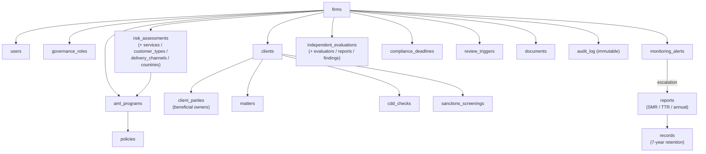

# Onus - Data Model

Documentation for the Onus data model: core entities, their relationships, and how
they map to the AML/CTF compliance domain - firms, users and governance, risk
assessments, the AML/CTF program and policies, clients, matters, customer due
diligence (CDD), sanctions/PEP screening, monitoring alerts, reports, records,
independent evaluations, and the audit log.

The schema is fully implemented and managed with Alembic migrations in
[`engine/alembic/`](../../engine/alembic); the SQLAlchemy models are the source of
truth in [`engine/models.py`](../../engine/models.py). The per-section specs under
[`../specs/`](../specs/README.md) carry the regulatory grounding (Act and Rules
citations) for each entity.

## Entity overview

## Conventions

- **Tenant isolation.** Every firm-scoped table carries a `firm_id` and is protected by
  Postgres row-level security (`ENABLE` + `FORCE`), keyed on the per-request
  `app.current_firm_id` GUC and failing closed when it is unset. See migration
  `b7c8d9e0f1a2_row_level_security.py`.
- **Timestamps** are timezone-aware (`DateTime(timezone=True)`, UTC) so audit,
  deadline and retention dates convert cleanly to Australian local time.
- **Deletes.** Ephemeral sub-components (risk-assessment categories, policies,
  evaluation findings) cascade with their parent; retention-critical data (clients,
  matters, reports, records) is never cascade-deleted, preserving the 7-year
  obligation (Act ss107-116).
- **Audit log** is append-only - there are no update or delete endpoints for it.

For the authoritative column list, consult `engine/models.py`; for the migration
history, `engine/alembic/versions/`.
